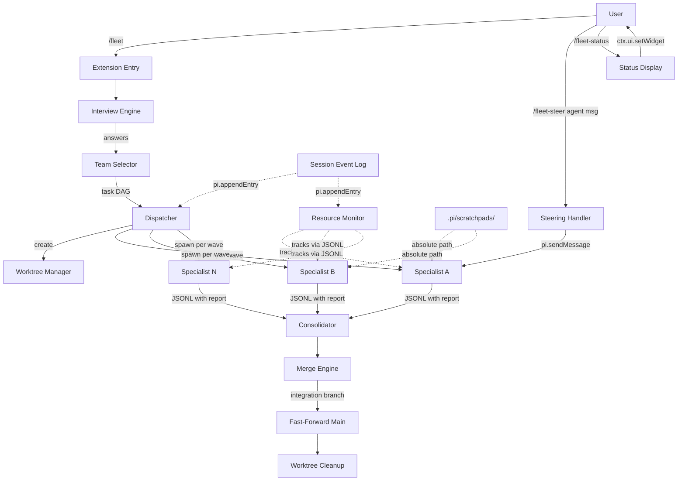

# pi-fleet: Multi-Agent Terminal Orchestration Harness Extension

## Overview

pi-fleet is a pi-agent extension that provides configuration-driven multi-agent orchestration. Specialist agents collaborate in parallel, each isolated in their own git worktree, coordinated by a dispatcher that interviews the user, delegates work, consolidates results, and merges changes automatically. Also supports deterministic sequential pipelines via agent-chain.yaml.

## PRD Reconciliation

The PRD (PRD.md) describes a broader vision including a standalone TUI dashboard (Textual/Bubble Tea), OpenTelemetry metrics, and a regex-based Safety Engine. This implementation intentionally narrows scope based on interview decisions:

| PRD Feature | Implementation Decision | Rationale |
|---|---|---|
| TUI Dashboard (Textual/Bubble Tea) | Pi UI primitives only (setWidget, setStatus) | User chose "Pi UI only" — no external TUI framework |
| dispatch_agent tool | Default extension behavior via /fleet command | User chose "Default extension behavior" — dispatcher IS the primary agent |
| Safety/Damage Control engine | Delegate to pi's built-in permission system | User chose "Delegate entirely to pi" |
| OpenTelemetry metrics | Pi event hooks for cost tracking | Lighter-weight, pi-native approach |
| Cross-provider fallback | Delegate to pi's native provider handling | Not a v1 priority per user decision |
| Brief markdown file as dispatcher input | Interactive interview via pi UI (8-12 questions) | Richer context gathering; optional `--brief <file>` deferred to future version |

If PRD.md is updated, re-evaluate these decisions.

## Scope

### In scope
- Extension entry with /fleet, /fleet-status, /fleet-steer commands
- Config system: .pi/teams.yaml + .pi/agents/*.md with Zod validation
- Interactive setup from pre-built templates (Architect, Developer, Reviewer, Researcher, QA, DevOps)
- Interview engine (8-12 questions) with automatic team selection
- DAG-based task dependency resolution with wave-parallel execution via Kahn's algorithm
- Specialist execution in isolated git worktrees via spawn("pi", ["--mode", "json", ...])
- Three-way merge: git merge --no-commit, node-diff3 for residual conflicts, dispatcher resolution
- Cost tracking from JSON-mode msg.usage output, budget/time enforcement
- Session persistence via pi.appendEntry() JSONL, resume via event replay
- Agent-chain.yaml sequential pipeline mode with $INPUT substitution (canonical path: `.pi/agent-chain.yaml`)
- Steering via /fleet-steer <agent-name> <message>
- Status via /fleet-status using ctx.ui.setWidget() text-based display
- Scratchpad files centralized in main repo's .pi/scratchpads/<agent-name>.md (absolute path passed to worktree agents)
- README.md and CLAUDE.md documentation

### Out of scope (deferred)
- Standalone TUI dashboard (Bubble Tea / Textual) — use pi UI primitives only
- Cross-provider fallback — delegate to pi's native provider handling
- Safety/damage control engine — delegate to pi's permission system
- Composed chain+dispatcher mode

## Approach

### Pi SDK Integration Points
- **Extension factory**: `export default function(pi: ExtensionAPI)` — registers commands, tools, event handlers
- **Distribution**: In `package.json`, the pi-specific field is `"pi": { "extensions": ["./dist/extension.js"] }` (array of entry points, matching dorkestrator's pattern). Built by esbuild. The build config lives in `esbuild.config.ts` and is executed via `tsx esbuild.config.ts` (esbuild CLI does not natively consume .ts config files). Scripts: `"build": "tsx esbuild.config.ts"`, `"dev": "tsx esbuild.config.ts --watch"` (pass `--watch` via process.argv). The config file calls `esbuild.build()` or `esbuild.context().watch()` programmatically.
- **Subagent spawning**: `spawn("pi", ["--mode", "json", "-p", "--no-session", "--model", model, ...])` — streams JSONL events with usage stats. Report is the final assistant message content within the JSONL stream (NOT raw stdout text)
- **UI**: `ctx.ui.select/confirm/input/notify/setStatus/setWidget/setWorkingMessage` for all user interaction
- **Persistence**: `pi.appendEntry("fleet-event", data)` for event sourcing, `ctx.sessionManager.getEntries()` for replay
- **Front matter**: `parseFrontmatter()` from `@mariozechner/pi-coding-agent` for agent .md files
- **Tool schemas**: `@sinclair/typebox` for registerTool params (runtime dependency — must be in `dependencies`, optionally also peerDeps to dedupe with host), Zod for config validation
- **Steering**: **Scratchpad-based steering is the primary v1 mechanism.** Before constructing any scratchpad path, validate that the agent name is one of: `"all"`, `"dispatcher"`, or an exact match in the running SpecialistRuntime roster (filename stems only). Reject names containing path separators (`/`, `\\`, `..`) to prevent path traversal. Append to `.pi/scratchpads/<agent-name>.md` using a standardized format: `\n\n---\n\n[STEER <ISO-timestamp> from=<source>]\n<message>`. This ensures multiple rapid steers and "all" broadcasts produce parseable, ordered content. Agents read cooperatively between tool calls. Delivery is best-effort (agent may finish before reading). `pi.sendMessage()` is aspirational — it requires a host-assigned routable ID (not the extension-generated `runId` UUID). If task 1's smoke test discovers a real routable ID in the JSONL stream (e.g., a session_id or agent_id emitted by the host), persist it in `specialist_started` events and enable `sendMessage` steering as an upgrade. Otherwise, scratchpad steering is the only path. If scratchpad write fails, notify user that steer delivery failed (no automatic stop/restart in v1 — the complexity of reconstructing prompt context, worktree state, and preventing duplicated work is out of scope).

### SDK Surface Validation
Task 1 includes an explicit SDK validation step split into two tiers. **Tier 1 (must-compile, hard-fail)**: methods the extension cannot function without — `registerCommand`, `appendEntry`, `exec`, `ctx.ui.select/confirm/input/notify/setWidget/setStatus`, `ctx.sessionManager.getEntries()`. The check constructs representative typed calls (not just property existence): call `pi.exec("git", ["status"])` and assign result to a typed variable expecting `{ stdout: string, code: number }`, call `getEntries()` and assign to a typed variable expecting array with `customType` field, pass typed arguments to `registerCommand` and `appendEntry` matching actual downstream usage signatures. This catches argument count, type, and return shape mismatches at compile time. Compiled via `tsc --noEmit` typecheck gate; failure blocks the build. **Tier 2 (nice-to-have, non-gating)**: methods that enhance the experience but have workarounds — `on("session_shutdown", ...)` (cleanup fallback: process signal handling via `process.on("SIGTERM", ...)`), `sendMessage` (steering fallback: scratchpad), `setThinkingLevel` (omit if unavailable), `setWorkingMessage` (fallback: use `setStatus` or no-op via runtime helper `setWorking(ctx, msg)`). If `session_shutdown` event name differs in the actual SDK, update the event name and fall back to process signals — this should not block the build. Tier 2 lives in a separate `sdk-check-tier2.ts` **excluded from the main tsconfig.json `include`**. A separate script `npm run typecheck:tier2` compiles it via a dedicated tsconfig.tier2.json and is allowed to fail (`|| true`); tsc error output serves as the diagnostic (no custom wrapper needed). Additionally, task 1 includes a **manual smoke script** (`scripts/smoke.ts` run via `npm run smoke` using tsx, NOT a vitest test — not in the test/ discovery tree) that: (a) validates pi CLI flags by spawning `pi --mode json -p --no-session --model sonnet "echo test"` with a hard timeout — **classification criteria**: "flags accepted" means the process started AND emitted at least one valid JSONL line before exit/timeout (not just "didn't print unknown flag"). "flags rejected" means "unknown" or "unrecognized" in stderr. "permission needed" means interactive prompt detected. "model unavailable" means model-specific error. "other error" is the catch-all. If the first attempt (trailing arg) fails for any reason, try stdin pipe variant. Record both results in smoke-results.json (`cliFlags.trailingArgResult` and `cliFlags.stdinPipeResult`) with a top-level `preferredPromptMode: "trailing-arg" | "stdin-pipe" | null` field that task 6's spawner reads to choose the working mode without re-discovering, (b) validates JSONL event shapes from successful spawn output, (c) tests scratchpad write access: creates `.pi/scratchpads/` if needed, creates a real git worktree via `git worktree add ../<project>-fleet-smoke-<timestamp>` (unique name, try/finally cleanup) and spawns pi with that worktree as cwd, instructs it to write to `<repo-root>/.pi/scratchpads/smoke-test.md` (this directly validates the sibling-worktree scenario), (d) checks for a host-assigned routable ID in the JSONL stream for sendMessage steering. The script may require interactive permission approvals. `npm run smoke` always writes `.pi/smoke-results.json` on completion (no env var gating). A vendored JSONL fixture in `test/fixtures/sample-jsonl.txt` provides representative events for task 6's offline parser tests (task 1 creates the fixture; task 6 writes the parser and its vitest tests).

### Dev Dependencies
Task 1 must declare all build toolchain devDeps: `typescript`, `esbuild`, `vitest`, `tsx`, `@types/node`. These are in addition to the pi SDK peer+devDeps and the runtime deps.

### Runtime Dependencies
- `zod` — config validation
- `yaml` — YAML parsing (may already be a transitive dep from pi, but declare explicitly)
- `p-limit` — concurrency control for wave execution
- `node-diff3` — programmatic three-way text merge for conflict resolution

### Test File Convention
Every task that creates source files in `src/` must also create corresponding test files in `test/` mirroring the directory structure (e.g., `src/session/state.ts` → `test/session/state.test.ts`). **Exception**: entrypoint/wiring files (e.g., `src/extension.ts`) that only register commands and delegate to other modules are exempt — their behavior is covered by the modules they call. Test files are listed in each task's **Files** field alongside the source files. Task 1 establishes the vitest configuration; all subsequent tasks add tests for their modules. Integration tests that require git (tasks 5, 8) use isolated tmpdir repos with local config.

### In-Extension Spawn Environment
The smoke script (`scripts/smoke.ts`) runs in a developer's terminal, which may differ from the environment inside a running pi extension (different PATH, sandbox restrictions, permission model). Task 1's smoke captures baseline behavior. After the extension is built, verify the core spawn path works by running `pi install .` followed by invoking `/fleet` with a trivial config — this is a manual integration test documented in README (task 11), not an automated gate. The risk is accepted and documented: if pi's extension sandbox restricts `child_process.spawn`, the extension will fail at runtime with a clear error from the spawner (task 6), not silently.

### ESM Artifact Validation
Task 1's smoke script includes an ESM loading check: `node --input-type=module -e "import('./dist/extension.js')"` after esbuild build completes. This validates that the bundled artifact is loadable as ESM by Node.js. It does NOT validate that pi can load it (pi's internal module resolution may differ), but catches obvious bundling errors (missing exports, CJS-only output, syntax errors). The `pi install .` manual test (documented in README) is the definitive validation that pi can load the extension.

### Key Patterns (from research)
- **Worktree root strategy**: Task 1's smoke script creates a real git worktree via `git worktree add -b fleet-smoke-<timestamp> ../<project>-fleet-smoke-<timestamp> HEAD` (unique names prevent collisions from prior failed runs). Spawns a pi subprocess with that worktree as cwd, then instructs it to write to the absolute path `<repo-root>/.pi/scratchpads/smoke-test.md`. Using an actual git worktree (not a plain tmpdir) validates the real scenario since pi may behave differently inside vs outside a git repo. Before creating the worktree, check for detached HEAD via `git symbolic-ref -q HEAD` (exit non-zero when detached) and for no commits via `git rev-parse --verify HEAD` (fails with no commits); if in detached HEAD or no commits, mark scratchpad test as "skipped" (not "failed") in smoke-results.json. The entire scratchpad test is wrapped in try/finally: on failure, `git worktree remove --force` and `git branch -D` ensure cleanup even on crash. Partial failures are recorded per-step in smoke-results.json (e.g., `scratchpadTest: { ok: false, error: "..." }`) rather than treating the whole smoke run as pass/fail. The worktree root is **always outside the repo** to avoid git's rejection of nested worktrees. Default location: `path.join(repoRoot, "..", "<project>-fleet-worktrees")`. The smoke test's scratchpad write check validates whether pi subprocesses in sibling directories can write back to the main repo's `.pi/scratchpads/`. If that fails (sandbox blocks cross-directory writes), scratchpads are copied into each worktree's local `.pi/scratchpads/` by the dispatcher and periodically synced back to the main repo by the resource monitor. The smoke result is treated as a *hint* — if sibling directory creation fails at runtime, fall back to OS temp directory (`os.tmpdir()`). The smoke script ensures `.pi/` and `.pi/scratchpads/` directories exist before testing. Task 5 reads the result from smoke-results.json. The chosen strategy is documented in README.
- **smoke-results.json is developer-local**: `.pi/smoke-results.json` is written by `npm run smoke` (manually invoked — no PI_SMOKE env var gating). It must be in `.gitignore` — it captures machine-specific capability flags (filesystem permissions, pi version behavior) that differ between developers. If absent, all consumers default to safe fallbacks (sibling worktree dir, scratchpad-based steering). The smoke script records the pi CLI version (`pi --version` output) in `smoke-results.json` as an informational field for debugging. No automated version comparison or startup warning — there is no reliable way to compare a CLI version string against npm package type versions. Developers can manually check the recorded version when debugging unexpected behavior.
- **Centralized scratchpads**: Scratchpads live in the main repo's `.pi/scratchpads/` (NOT in worktrees). Specialists receive the absolute path via their system prompt. Since worktrees are always outside the repo, this works when pi allows cross-directory writes. If cross-directory writes are restricted (smoke test result), the dispatcher periodically copies scratchpad content between worktree-local copies and the main repo's `.pi/scratchpads/`.
- **DAG execution**: Kahn's algorithm produces execution waves. `p-limit` for concurrency control within waves. Each task assignment includes `expectedPaths: string[]` (approximate file paths the agent will touch). The DAG builder uses these to conservatively sequence tasks with overlapping paths into different waves. If `expectedPaths` is empty or absent, the task defaults to sequential execution (safe fallback).
- **Event schema**: Two-layer parsing for forward compatibility. Layer 1 (envelope): `z.object({ schemaVersion: z.number(), type: z.string(), timestamp: z.string() }).passthrough()` — accepts ALL events including unknown future types. Layer 2 (known events): a map of per-type Zod schemas for recognized event types. Unknown `type` values are preserved as `UnknownFleetEvent` and skipped by state reducers. This avoids the `z.discriminatedUnion()` trap where unknown type values would be rejected. Events: session_start, interview_complete, team_selected, task_graph_created, worktree_created, specialist_started, specialist_completed, specialist_failed, cost_update, merge_started, merge_completed, merge_conflict, consolidation_complete, session_complete, budget_warning, time_warning, session_aborted.
- **JSONL parsing**: Tolerant parsing of pi's JSON-mode output. Accept multiple event type variants (message_end, assistant_message_end). Ignore unknown event types. Report extraction: "last assistant message content in the stream" (deterministic rule). Handle edge cases: multiple assistant messages (take last), tool-use messages (skip), partial lines (buffer). Tests must cover these via vendored fixture.
- **ESM interop**: `node-diff3` is CJS; canonical import: `import diff3 from 'node-diff3'` then call `diff3.diff3Merge(theirs, base, ours)` (the default export is the module namespace, not diff3Merge directly). Requires `esModuleInterop: true` and `allowSyntheticDefaultImports: true` in tsconfig.json (esbuild handles the actual CJS→ESM transform at bundle time). Add a minimal unit test (`test/node-diff3-interop.test.ts`) that uses this exact import pattern and asserts argument ordering: verify which argument position corresponds to "ours" vs "theirs" by testing with known conflicting inputs and checking conflict marker ordering in the result. Document the verified ordering so task 8 matches exactly. Both production code (task 8) and the interop test (task 1) must use the same import style.
- **Repo root resolution**: `preflight()` resolves the repo root via `pi.exec("git", ["rev-parse", "--show-toplevel"])` and returns it as `repoRoot` in its result. All downstream code receives `repoRoot` from preflight — never assumes `process.cwd()` is the repo root (users may run `/fleet` from a subdirectory). `repoRoot` is threaded through: config loaders (resolve `.pi/` paths relative to repoRoot), prompt composer (scratchpad absolute paths), worktree manager (smoke-results.json path), and persisted in `session_start` events for resume correctness.
- **Pre-flight / loader boundary**: Preflight handles environment validation: git repo, shallow clone, dirty tree gating, repoRoot resolution. Config loaders (teams.ts, agents.ts, chains.ts) handle config existence check + YAML parse + Zod schema validation with user-friendly errors including file path context. Preflight does NOT parse or validate config schemas — that's the loaders' job.
- **Pre-flight centralization**: Pre-flight validation is split into two focused functions in task 1, both reused by later tasks:
  - `preflightBootstrap({ pi })`: resolves repoRoot via `git rev-parse --show-toplevel`, validates git repo (hard-fail via `git rev-parse --git-dir`), detects shallow clone (hard-fail). Returns `{ repoRoot: string }`. Cheap, always safe to call.
  - `preflightRunChecks({ repoRoot, allowDirty, pi, ctx })`: checks `.pi/teams.yaml` existence (just `fs.access()`), runs dirty-tree gating (if dirty and `!allowDirty`: warn + require `ctx.ui.confirm()`). Takes repoRoot as input — never recomputes it.
  **Concrete handler flow**: `/fleet` always calls `preflightBootstrap()` first. Then checks `path.join(repoRoot, ".pi/teams.yaml")` existence. If missing → setup wizard. If present → calls `preflightRunChecks()` for dirty-tree gating → `--resume` check → dispatch. Two separate functions, clear responsibilities, no mode parameter confusion. The `/fleet` command handler parses its args for `--allow-dirty` and `--resume` and passes them through.
- **Merge flow**: (1) Record base commit SHA at session start, (2) create integration branch, (3) git merge --no-commit per specialist, (4) node-diff3 for text conflicts, (5) dispatcher resolves semantic conflicts, (6) on failure: git merge --abort, (7) fast-forward original branch if base hasn't drifted (if drifted: rebase integration branch). Bounded merge safe window: allow up to 30s for merge completion during budget-triggered shutdown, then leave integration branch for manual inspection.
- **Graceful shutdown**: Two-phase — SIGTERM with 60s grace period, then SIGKILL. Bounded merge safe window prevents deadlock. Flush event log. Clean up worktrees. process.once() to prevent double-fire.
- **Runtime state access**: A module-level singleton store (`src/session/runtime-store.ts`) holds the in-memory FleetState during execution. `/fleet` populates it on start/resume; `/fleet-steer` reads it to validate agent names against the running roster; `/fleet-status` reads it for display (falling back to event replay via task 3 when the store is empty, e.g., after process restart). The store is NOT persisted — it's reconstructed from events on resume. This pattern avoids threading FleetState through every command handler.
- **Config paths**: All fleet config under `.pi/` — `.pi/teams.yaml`, `.pi/agents/*.md`, `.pi/agent-chain.yaml`, `.pi/scratchpads/`. No configurable `paths` overrides in v1 — all locations are hardcoded under `.pi/`. Session persistence uses pi.appendEntry() (pi-managed JSONL), NOT custom files.
- **Agent identity**: Agents are identified by their filename stem (e.g., `architect.md` → id `architect`). The `name` field in front matter is a display name. `teams.yaml.members` references filename stems. `/fleet-steer <id>` routes by this stable identifier. Events persist `agentName` = filename stem.
- **teams.yaml canonical shape**: Single team object (v1 supports one team per file). YAML uses consistent snake_case: `{ team_id: string, orchestrator: { model: string, skills: string[] }, members: string[], constraints: { max_usd: number, max_minutes: number, task_timeout_ms?: number, max_concurrency: number } }`. `task_timeout_ms` is optional (default 120000). The Zod schema uses `strict()` mode — unknown keys are rejected with a clear error message (e.g., "Unknown key 'paths' in teams.yaml — remove it or check the documentation"). This prevents silent config drift. Agent front matter uses `passthrough()` for forward compat (different concern: agents may have custom keys for other tools). The Zod schema transforms snake_case YAML keys to camelCase TypeScript types on load (e.g., `task_timeout_ms` → `taskTimeoutMs`, `max_concurrency` → `maxConcurrency`). Downstream TS code uses camelCase exclusively. `/fleet` uses this team directly. Multi-team support deferred.
- **Agent front matter contract**: Required: `name` (display), `model`. Optional: `skills: string[]`, `expertise: string`, `thinking: string`. Extra keys allowed (Zod passthrough for forward compat). Templates must match this contract exactly.
- **AGENTS.md injection**: For v1, inject only the repo-root `AGENTS.md` (if present). Nested `AGENTS.md` files in subdirectories are not walked. This keeps prompt composition deterministic and testable.

### Architecture Diagram



### Data Flow: Chain Mode


## Risks & Mitigations

| Risk | Likelihood | Impact | Mitigation |
|------|-----------|--------|------------|
| Pi SDK API surface differs from research | Medium | High | Task 1 SDK validation step: typecheck against real types before building |
| JSONL event names/shapes differ | Medium | High | Tolerant parsing: accept variants, ignore unknowns, test against official subagent example |
| Worktree creation slow on large repos | Medium | Medium | Pool pattern pre-creates worktrees. Progress indication via setWorkingMessage |
| Three-way merge produces broken code | Low | High | Merge to integration branch first. Run tests if available. Bounded merge window on shutdown |
| Scratchpad race conditions | Low | Medium | Per-agent files (not shared). Absolute path to main repo. |
| Base branch drifts during execution | Low | Medium | Record base SHA at session start. Detect drift before fast-forward. Rebase if needed. |
| Budget shutdown during merge | Low | High | Bounded 30s merge safe window. Leave integration branch for manual resolution if exceeded. |
| JSONL corruption on crash | Low | Medium | Skip unparseable entries. schemaVersion for forward compat. Passthrough Zod parsing. |

## Non-Functional Targets

- Worktree creation: < 5s per worktree (pool pre-creation helps)
- Session resume: < 2s for logs under 10,000 events
- Cost tracking latency: < 1s behind actual spend
- Memory: < 100MB overhead beyond pi's baseline

## Rollout / Rollback

- **Phase 1**: Scaffold + config + templates + interview (usable for config validation)
- **Phase 2**: Worktree + DAG execution + resource monitoring (core dispatch loop)
- **Phase 3**: Merge + chain + steering + status (full feature set)
- **Phase 4**: Documentation + polish
- **Rollback**: `pi uninstall pi-fleet`. No persistent state outside .pi/ directory.

## Quick Commands

```bash
# Build (for npm distribution)
npx esbuild src/extension.ts --bundle --platform=node --format=esm --outdir=dist --external:@mariozechner/*

# Test
npx vitest run

# Smoke test (manual, requires pi on PATH)
npm run smoke

# Install locally for testing
pi install .
```

> Note: The exact `pi install` invocation pattern should be verified against `pi --help` during task 1. The commands above reflect the expected pattern from dorkestrator; adjust if pi's CLI differs.

## Acceptance

- [ ] Extension installs via `pi install` and registers /fleet, /fleet-status, /fleet-steer commands
- [ ] pi.extensions points to dist/extension.js for npm distribution
- [ ] .pi/teams.yaml and .pi/agents/*.md configuration system works with Zod validation
- [ ] Interactive setup creates config from templates when no teams.yaml exists
- [ ] 6 pre-built agent templates ship (Architect, Developer, Reviewer, Researcher, QA, DevOps)
- [ ] Interview engine conducts 8-12 question discovery via pi UI methods
- [ ] Dispatcher automatically selects agents and creates task DAG from interview results
- [ ] Specialists execute in isolated git worktrees with automatic merge back
- [ ] Three-way merge handles file conflicts (git merge + node-diff3 + dispatcher resolution)
- [ ] Merge uses integration branch with base SHA tracking and drift detection
- [ ] .pi/agent-chain.yaml pipeline mode auto-detected and functional with $INPUT substitution
- [ ] Cost tracking via JSON-mode msg.usage parsing with per-agent attribution and model ID normalization
- [ ] Budget/time limits enforced (soft warnings at 80%, hard limits with 60s graceful shutdown + 30s merge safe window)
- [ ] Scratchpad files centralized in main repo's .pi/scratchpads/ with absolute paths for worktree agents
- [ ] Session state persisted via pi.appendEntry() with schemaVersion, resumable via /fleet --resume
- [ ] /fleet-steer <agent-name> routes messages via scratchpad steering (primary v1 mechanism); sendMessage upgrade only if smoke test discovers a real host-assigned routable ID
- [ ] /fleet-status renders text-based status via ctx.ui.setWidget()
- [ ] Model routing respects agent defaults with dispatcher override capability
- [ ] CLAUDE.md and repo-root AGENTS.md (only) injected into agent system prompts (best-effort: if missing, inject nothing and continue)
- [ ] Pre-flight checks: git repo (hard-fail), shallow clone (hard-fail), dirty working tree (soft-block: warn + require confirmation or --allow-dirty)
- [ ] Per-agent taskTimeoutMs configurable with sensible default (120s)
- [ ] Graceful handling of interview cancellation, worktree failures, JSONL corruption
- [ ] Runtime deps (zod, yaml, p-limit, node-diff3) explicitly declared in package.json
- [ ] SDK surface validation: tier 1 (registerCommand, appendEntry, exec, ui methods, getEntries) hard-fails via `tsc --noEmit`; tier 2 (session_shutdown, sendMessage, setThinkingLevel) in separate file excluded from main tsconfig, non-gating `npm run typecheck:tier2 || true`
- [ ] Runtime smoke script (`npm run smoke`, manual, may require interactive approvals): validates JSONL event shapes, scratchpad write access, host-assigned routable ID discovery for sendMessage
- [ ] CLI flag validation: pi CLI flags (--mode json, -p, --no-session, --model) verified against pi --help or official example
- [ ] Vendored JSONL fixture in test/fixtures/ for unconditional offline spawner parser validation
- [ ] Node.js >= 20 hard requirement (engines field + runtime startup guard that throws if process.versions.node < 20)
- [ ] Agent identity: filename stem = stable id, members[] uses stems, steer routes by stem
- [ ] Pi SDK as both peerDeps and devDeps, @sinclair/typebox in dependencies (+ optionally peerDeps), @types/node as devDep, ESM settings ("type": "module")
- [ ] Worktree root always outside repo (sibling dir default, OS tmpdir fallback); no nested worktrees inside repo
- [ ] .gitignore includes `.pi/scratchpads/` and `.pi/smoke-results.json` (plus standard Node ignores like `node_modules/`, `dist/`) but does NOT ignore `.pi/` wholesale — teams.yaml and agents/ must be tracked; worktrees live outside repo
- [ ] teams.yaml canonical shape: single team object, documented with example
- [ ] Agent front matter contract: required (name, model), optional (skills, expertise, thinking), passthrough extras
- [ ] Pre-flight checks centralized in task 1: `preflightBootstrap()` (repoRoot + git checks) and `preflightRunChecks()` (config existence + dirty tree gating)
- [ ] preflight() resolves and returns repoRoot via `git rev-parse --show-toplevel`; all .pi/ paths derived from repoRoot (never process.cwd())
- [ ] repoRoot threaded through config loaders, prompt composer, worktree manager, and persisted in session_start events
- [ ] teams.yaml uses consistent snake_case; Zod schema transforms to camelCase TS types on load
- [ ] Smoke worktree uses unique names (timestamp suffix) with try/finally cleanup and per-step partial failure recording
- [ ] esbuild config executed via `tsx esbuild.config.ts`; scripts: build, dev (--watch)
- [ ] node-diff3 ESM import verified via unit test; tsconfig has esModuleInterop + allowSyntheticDefaultImports
- [ ] Test files mirror src/ structure in test/ for every task (convention documented)
- [ ] Smoke test sibling-worktree validation uses `git worktree add` (not plain tmpdir)
- [ ] Smoke script validates ESM artifact loading via `node --input-type=module -e "import('./dist/extension.js')"`
- [ ] smoke-results.json includes pi CLI version (informational, no automated comparison)
- [ ] In-extension spawn environment risk documented in README; manual `pi install . && /fleet` integration test described
- [ ] .pi/scratchpads/ gitignore tradeoff documented in README (local-only vs team-shared considerations)
- [ ] teams.yaml Zod schema uses `strict()` mode (rejects unknown keys); agent front matter uses `passthrough()`
- [ ] Scratchpad append format standardized: `\n\n---\n\n[STEER <timestamp> from=<source>]\n<message>` with test asserting format
- [ ] /fleet-steer validates agent name against running roster; rejects path separators (`/`, `\\`, `..`) to prevent path traversal
- [ ] Module-level runtime store (`src/session/runtime-store.ts`) provides shared FleetState access across command handlers
- [ ] Entrypoint wiring files exempt from test file convention (behavior covered by delegated modules)
- [ ] smoke-results.json includes `preferredPromptMode` field; task 6 spawner reads it
- [ ] Task assignments include `expectedPaths: string[]` for conservative DAG sequencing
- [ ] node-diff3 interop test verifies argument ordering (which position = ours vs theirs)
- [ ] vitest.config.ts sets `include: ["test/**/*.test.ts"]` explicitly (excludes scripts/)
- [ ] Smoke worktree creation checks HEAD validity; marks scratchpad test as "skipped" in detached HEAD

## References

> These are **design-time references only** — consulted during planning for patterns and API shapes. None are runtime dependencies of pi-fleet. The only runtime dependencies are listed in the Runtime Dependencies section above.

- Pi extension types: `@mariozechner/pi-coding-agent/dist/core/extensions/types.d.ts`
- Official subagent example: `badlogic/pi-mono/packages/coding-agent/examples/extensions/subagent/`
- Pi SDK docs: `github.com/badlogic/pi-mono/blob/main/packages/coding-agent/docs/extensions.md`
- Dorkestrator reference: `/Users/eric/Development/code/Pi-Harness/dorkestrator/` (local checkout, pattern reference only)
- Worktree pool pattern: Windmill `worktree-pool.ts`, Roo-Code `worktree-service.ts` (pattern inspiration only)
- Event sourcing: `oskardudycz/EventSourcing.NodeJS` (pattern inspiration only)
- node-diff3: `github.com/bhousel/node-diff3` (runtime dep — listed in package.json)
- p-limit: `github.com/sindresorhus/p-limit` (runtime dep — listed in package.json)
