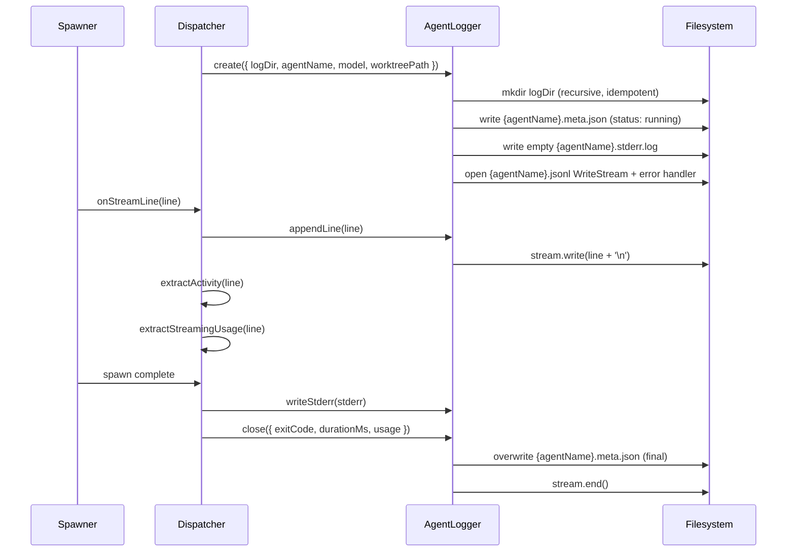

# Persistent Agent Logging for Fleet Sessions

## Overview

When fleet agents fail, their JSONL output stream (stdout) and stderr are parsed in-memory and discarded. Users have no way to investigate failures after the fact. The error display shows truncated LLM diagnoses or "failed with no output" — and there's nowhere to dig deeper.

This epic adds persistent per-agent log files that capture normalized JSONL lines to disk, survive crashes, and are viewable via a new `/fleet-logs` command.

Note: the spawner trims whitespace from each JSONL line before passing to callbacks. Logs capture these normalized lines, not byte-for-byte raw stdout. This is fine for JSONL diagnostic purposes.

## Scope

**In scope:**
- `AgentLogger` module: per-agent write streams for JSONL stdout, stderr, and structured metadata
- Dispatcher integration: wire logger into the `onStreamLine` callback alongside existing activity/cost extraction
- `/fleet-logs` command: browse sessions and view agent logs from disk
- Enhanced error display: log file paths shown alongside failure diagnoses
- Log rotation: keep last N sessions, clean on session start
- `.pi/logs/` gitignored
- Doc updates (CLAUDE.md module structure + config paths, README command table)

**Out of scope:**
- Chain mode logging (chain runner doesn't use `onStreamLine` — separate epic)
- Log streaming/tailing (live follow of in-progress agent output)
- Log export/sharing features
- Merging `/fleet-log` (in-memory activity overlay) with `/fleet-logs` (persistent file viewer)

## Architecture

### Data Flow



### Directory Structure

```
.pi/logs/
  {sessionId}/                    # e.g., m1a2b3c (Date.now().toString(36))
    developer.jsonl               # Normalized JSONL lines from "developer" agent
    developer.stderr.log          # Stderr capture (always present, may be empty)
    developer.meta.json           # Per-agent metadata
    qa.jsonl
    qa.stderr.log
    qa.meta.json
    reviewer.jsonl
    reviewer.stderr.log
    reviewer.meta.json
```

Each agent gets its own `.meta.json` file (not a shared `meta.json`). This avoids collision when multiple agents run concurrently and eliminates locking concerns.

### Key Decisions

1. **AgentLogger follows ActivityStore pattern** — created in `dispatch()`, populated via `onStreamLine`. Only `logDir` (string) is stored in runtime-store for `/fleet-logs` to read. Logger instances are not serialized or returned in `DispatchResult` — the command reads from disk.

2. **`onStreamLine` stays sync** — `stream.write()` handles internal buffering with backpressure. No interface change needed. If write returns `false`, data is buffered by Node's stream internals (64KB highWaterMark). For diagnostic logs, this is acceptable.

3. **Per-agent meta files (`{agentName}.meta.json`)** — written twice per agent lifecycle:
   - At agent start: `fs.writeFile` with `{ agentName, startedAt, model, worktreePath, status: 'running' }`
   - At completion: `fs.writeFile` (overwrite) adding `{ exitCode, durationMs, usage, status, completedAt }`
   - Both writes use `fs.writeFile` (overwrite). No atomic rename — cross-platform safe (avoids Windows `fs.rename` failure when dest exists).
   - If the process crashes mid-execution, the meta file shows `status: 'running'` with no `completedAt`. `/fleet-logs` interprets this as "crashed/interrupted".

4. **Session-count rotation** — keep last 5 sessions (`KEEP_LOG_SESSIONS = 5` constant, not configurable — simplicity over premature configurability). In `extension.ts`: create session dir via `fs.mkdir` immediately after sessionId, then call `rotateSessionLogs(logsRootDir, KEEP_LOG_SESSIONS)` so the new session counts toward the limit. Sort numerically: `parseInt(name, 36)`. Ignore `NaN` entries. Uses `fs.rm(dir, { recursive: true, force: true })`.

5. **Explicit log directory APIs**:
   - `rotateSessionLogs(logsRootDir: string, keepCount: number)` — operates on `.pi/logs/`, scans subdirectories
   - `AgentLogger.create()` calls `mkdir(logDir, { recursive: true })` internally (idempotent). No separate `ensureLogDir()` needed — the logger owns directory creation.
   - `extension.ts` constructs: `logsRootDir = path.join(repoRoot, '.pi', 'logs')`, `logDir = path.join(logsRootDir, sessionId)`
   - `DispatcherOpts.logDir` receives `logDir`
   - Log dir creation and rotation are gated to dispatcher mode only. Chain mode (explicitly out of scope) must not trigger rotation or create log directories.

6. **Graceful degradation** — `AgentLogger.create()` wraps its entire body in try/catch. On ANY failure (invalid name, mkdir permission denied, disk full, writeFile error), logs `console.warn` and returns `null`. Callers use optional chaining (`logger?.appendLine()`). This guarantees logging never crashes the process or aborts agent execution. Agent name validation is inline (alphanumeric + hyphen + underscore).

7. **`logPath` on SpecialistFailedEvent** — new optional field persisted in the event log. Stored as repo-relative path (`.pi/logs/{sessionId}/{agentName}.jsonl`) for display. Absolute paths computed at read time by prepending `repoRoot`. `/fleet-errors` shows log paths for the current session only (reads from `getLogDir()` + agent name). Cross-session event replay deferred.

8. **exitCode threading** — `SpawnResult` gains an `exitCode: number` field. `buildSpawnResult()` in `spawner.ts` passes `raw.exitCode` through. Needed for meta.json.

9. **Logger cleanup and abort detection** — dispatcher tracks loggers in `Map<string, AgentLogger>`. At close time, checks `cancelSignal?.aborted`: if true, closes with `{ status: 'aborted' }`. Otherwise closes with `{ exitCode, durationMs, usage }` (status computed from exitCode). The `finally` block iterates all loggers and calls `close({ status: 'aborted' })` as safety net — `close()` is idempotent via `_closed` flag. This is the simplest correct approach: if the signal fired, the agent was interrupted.

10. **Empty stderr policy** — `AgentLogger.create()` writes an empty `.stderr.log` immediately at creation time. This guarantees the file always exists, even if `writeStderr()` is never called (crash/cancel paths). `writeStderr()` overwrites it with actual content when available.

11. **WriteStream error handling** — `AgentLogger` attaches `stream.on('error', handler)` at creation. On error, sets `_disabled` flag. `appendLine()` also wraps `stream.write()` in try/catch and flips `_disabled` on any synchronous exception (covers edge cases during teardown). All subsequent `appendLine()` calls are no-ops. Prevents process crash from disk full, permission denied, etc.

12. **`close()` signature** — accepts an options object: `close(opts: { exitCode?: number, usage?: Usage, status?: 'completed' | 'failed' | 'aborted' })`. No `durationMs` parameter — logger computes duration internally from `_startedAtMs` stored at `create()` time. Awaits stream flush: `await new Promise<void>(resolve => stream.end(resolve))`. Idempotent via `_closed` flag. Never throws (try/catch internally). Status defaults to `exitCode === 0 ? 'completed' : 'failed'` when not provided.

## Risks and Mitigations

| Risk | Likelihood | Impact | Mitigation |
|------|-----------|--------|------------|
| Disk fill from verbose agents | Low | Medium | Session-count rotation limits total dirs; per-file size not capped (acceptable for 5 sessions) |
| Sensitive data in logs | Medium | High | `.pi/logs/` gitignored; document risk in README |
| Write stream error crashes process | Medium | High | `stream.on('error')` handler sets `_disabled` flag; all writes become no-ops |
| Write stream not flushed on crash | Low | Low | JSONL is append-only; at most one partial line lost. meta write-on-start preserves partial data |
| Dispatcher merge conflicts with fn-2/fn-4 | Medium | Low | Logger wiring is additive (one line in `onStreamLine`); no structural changes to existing callback logic |
| `onStreamLine` backpressure | Low | Low | Node's WriteStream buffers internally; 64KB highWaterMark handles burst writes |
| Invalid agent name in file path | Low | Medium | Validation rejects traversal; warning logged; logging skipped for that agent |

## Non-Functional Targets

- Log writes must not block the event loop or slow agent execution
- Log rotation must complete in <100ms for typical session counts
- `/fleet-logs` must render within 1 second for sessions with up to 10 agents (use tail-from-end for large files, not full file read)

## Alternatives Considered

1. **Pipe stderr directly to file** — rejected because stderr is already accumulated as a string in `spawnWithMode()` (line 483-485 of spawner.ts). Writing it as a blob on completion is simpler and consistent.

2. **Use pi.appendEntry() for logging** — rejected because event log entries are typed/schemaed fleet events. Raw JSONL subprocess output doesn't fit that model and would bloat the session event log.

3. **Merge `/fleet-log` and `/fleet-logs`** — deferred. They serve different purposes (in-memory activity vs persistent files). Merging requires rethinking the activity overlay's data source. Better as a follow-up.

4. **Winston/Pino logging framework** — rejected. This is subprocess output capture, not application logging. A bare `createWriteStream` wrapper is the right tool.

5. **Atomic rename for meta.json updates** — rejected. `fs.rename()` fails on Windows when destination exists. `fs.writeFile` overwrite is cross-platform safe.

6. **Single shared meta.json per session** — rejected. Multiple agents write concurrently, requiring locking. Per-agent files are race-free.

## Rollout

1. Task 1: AgentLogger module (standalone, no existing code changes)
2. Task 2: Wire into dispatcher + spawner `exitCode` threading + event schema
3. Task 3: `/fleet-logs` command + error display + docs

Rollback: Remove `logDir` from `DispatcherOpts` and the `onStreamLine` logger call. The module is additive — no existing behavior changes.

## Quick commands

```bash
npm run typecheck   # Verify new module compiles
npm test            # Full test suite
npm run build       # Bundle with esbuild
```

## Acceptance

- [ ] Each agent's normalized JSONL lines are written to `.pi/logs/{sessionId}/{agentName}.jsonl`
- [ ] Each agent's stderr is written to `.pi/logs/{sessionId}/{agentName}.stderr.log` (always exists, even if empty)
- [ ] Per-agent `{agentName}.meta.json` records: agentName, startedAt, model, worktreePath, exitCode, durationMs, usage, status, completedAt
- [ ] meta.json written at agent start (status: running) and overwritten on completion via `fs.writeFile`
- [ ] `SpawnResult` includes `exitCode: number` threaded from `spawnWithMode()`
- [ ] WriteStream `'error'` event handled — sets `_disabled` flag, no process crash
- [ ] `close()` accepts options object with optional `status` override for 'aborted' case
- [ ] Empty `.stderr.log` created at logger init (survives crash/cancel paths)
- [ ] `/fleet-logs` command lists sessions and displays agent logs (tail-from-end for large files)
- [ ] `/fleet-errors` shows log file paths alongside error diagnoses (current session, post-dispatch)
- [ ] Failed agent progress widget shows log file path (via `FleetProgressComponent`)
- [ ] Log rotation: create new session dir first, then rotate to keepCount; sort numerically via `parseInt(name, 36)`
- [ ] `.pi/logs/` is in `.gitignore`
- [ ] Agent names validated before constructing file paths; invalid names log warning and skip
- [ ] Logger cleanup in dispatcher `finally` block closes all open streams with `status: 'aborted'`
- [ ] CLAUDE.md updated with module structure and config paths
- [ ] All existing tests pass; new module has test coverage
- [ ] `npm run typecheck` passes
- [ ] `npm run build` succeeds

## References

- `src/dispatch/spawner.ts` — `onStreamLine` callback (L22-23), `spawnWithMode` stdout buffering (L466-481), stderr accumulation (L483-485), `buildSpawnResult` (L501-523)
- `src/dispatch/dispatcher.ts` — `onStreamLine` wiring (L223-244), `DispatcherOpts` (L34-53), `DispatchResult` (L55-65), finally block (L336-338)
- `src/dispatch/types.ts` — `SpawnResult` interface (needs `exitCode`)
- `src/status/activity-store.ts` — pattern to follow for store lifecycle
- `src/status/fleet-progress-component.ts` — TUI component that renders failed agent status
- `src/session/events.ts` — `SpecialistFailedEvent` schema, `createFleetEvent()` helper
- `src/session/runtime-store.ts` — singleton pattern for cross-command state access
- `src/steer/handler.ts` — `isValidAgentName()` validation logic (not currently exported)
- `src/extension.ts:141` — `sessionId` generation
- `.gitignore` — existing `.pi/scratchpads/` entry to follow
